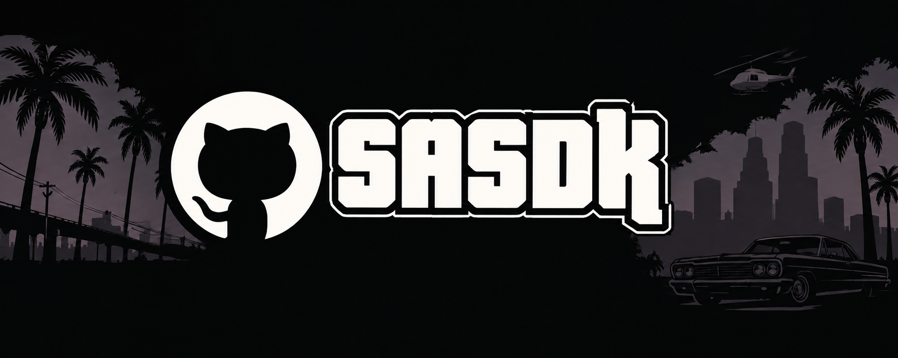

<div align="center">



<p><em>Production-grade C++20 modding SDK for Grand Theft Auto: San Andreas</em></p>

<a href="#">

</a>

<br/>

[](LICENSE)
[](https://en.cppreference.com/w/cpp/20)
[](#)
[](#)
[](https://www.teamvanilla.org/)

<br/>

[](../../stargazers)
[](../../issues)
[](../../commits)
[](../../releases)

<br/>

[](#)
[](#)
[](#)
[](#)
[](#)
[](#)
[](#)

</div>


SASDK is a production-grade C++20 SDK for modding GTA San Andreas (sa10us — HOODLUM 1.0 US, `170b3a9108687b26da2d8901c6948a18`). Hook into the game's live memory, read verified struct layouts derived from disassembly, or parse every major asset format offline — all from a single `#include <sasdk/sasdk.hpp>`.

It ships in two layers. **`SASDK::data`** is a compiled static library of offline format parsers — GXT text lookup, IMG archive extraction, COL2 collision data, RenderWare chunk traversal, FXP particle projects, save file blocks — that compile and test on any 64-bit host with no game required. **`SASDK::game`** is a header-only runtime layer with a 302-struct database generated from binary format specifications verified against the sa10us executable, plus typed globals, inline hooks, vtable hooks, and calling-convention helpers designed for 32-bit `.asi` plugin targets.

<div align="center">

### 📑 Contents

[Features](#-features-at-a-glance) · [Requirements](#️-requirements) · [Installation](#-installation) · [Quick Start](#-quick-start)

[Architecture](#️-architecture) · [Struct Database](#️-struct-database) · [Format Parsers](#-format-parsers) · [Runtime Layer](#-runtime-layer)

[Error Handling](#-error-handling) · [Generation Pipeline](#️-generation-pipeline) · [Source Layout](#-source-layout) · [Known Limitations](#-known-limitations)

</div>


## ✨ Features at a Glance

**Struct Database (`SASDK::game`)**
- **302 verified schemas** — all offsets confirmed by Capstone disassembly sweep and/or plugin-sdk `VALIDATE_OFFSET` compile-time asserts
- **6,545-line generated database** — `sa10us_db.inl`, never hand-edited
- **Four confidence tiers** — `[SASDK VERIFIED]`, `[SASDK VERIFIED_BY_DISASSEMBLY]`, `[SASDK REASONED]`, `[SASDK OPEN]`
- **`static_assert` on every struct** — size mismatch is a compile error, not a runtime surprise
- **Novel findings** — `CHandlingData` true size 0xE0 (community had 0xD4), `CExplosion` type count 21, `m_nVehicleFlags` 52 named bitflags previously anonymous in plugin-sdk

**Format Parsers (`SASDK::data`)**
- **`GxtArchive`** — TABL/TKEY/TDAT blocks; binary search by CRC-32 key hash (no final complement); 127 tables, 16,588 keys in american.gxt
- **`ImgArchive`** — VER2 32-byte TOC; 2,048-byte sector addressing; open/find/read by name
- **`ColArchive`** — COL2 multi-model; verified geometry element sizes; span access for spheres, boxes, triangles, lines
- **`RwStream` / `RwChunk`** — 12-byte chunk header; full type enum; nested child traversal for DFF / TXD / IFP
- **`FxpArchive`** — count-driven text grammar; full hierarchy — 82 systems, 161 emitters, 4,120 curves, 6,563 keyframes
- **`SaveArchive`** — `BLOCK ` tag framing; per-block span access; additive checksum

**Runtime Layer (`SASDK::game`)**
- **`InlineHook`** — 5-byte JMP patch with byte save and restore
- **`VmtHook`** — vtable slot swap with original capture
- **`Global<T>` / `ArrayView<T>`** — typed game memory access with automatic address rebasing
- **`call_cdecl` / `call_thiscall`** — type-safe function invocation against rebased virtual addresses
- **`fn::*`** — 9 typed callable handles for verified game functions
- **`Module::bind`** — one-call rebase; all addresses update globally
- **No exceptions** — `Result<T>` (`std::variant`-backed) throughout


## 🛠️ Requirements

| | |
|---|---|
| **Compiler** | MSVC 19.29+ with `/std:c++20`, GCC 12+, or Clang 14+ |
| **CMake** | 3.16+ |
| **Target** | Windows x86 (32-bit `.asi`); `SASDK::data` parsers compile on any host for CI |
| **GTA:SA** | sa10us — HOODLUM 1.0 US · MD5 `170b3a9108687b26da2d8901c6948a18` |


## 📦 Installation

```cmake
add_subdirectory(SASDK)

# Full SDK — struct DB + parsers + runtime (most mods use this)
target_link_libraries(my_asi PRIVATE SASDK::sasdk)

# Offline parsers only — tools and extractors that don't target the game process
target_link_libraries(my_tool PRIVATE SASDK::data)
```

### Single include

```cpp
#include <sasdk/sasdk.hpp>   // everything
```

Or individual headers for shorter compile times:

```cpp
#include <sasdk/gxt.hpp>     // GXT text archive
#include <sasdk/img.hpp>     // IMG archive
#include <sasdk/col.hpp>     // COL2 collision
#include <sasdk/rw.hpp>      // RenderWare chunk stream
#include <sasdk/fxp.hpp>     // FXP particle project
#include <sasdk/save.hpp>    // Save file blocks
```


## ⚡ Quick Start

```cpp
#include <sasdk/sasdk.hpp>
using namespace sasdk;
using namespace sasdk::sa10us;

// Rebase all virtual addresses once at startup
Module::bind(GetModuleHandleA(nullptr));

// Read CJ's health — CPed::m_fHealth @0x540, VALIDATE_OFFSET confirmed
float hp = Global<float>{ addr::CWorld_Players + 0x540 }.read();

// Inline hook a game function
auto hook = rt::InlineHook::install(addr::CVehicle_Fix.va, &my_vehicle_fix);

// GXT text lookup (binary search by CRC-32 hash, no final complement)
std::vector<uint8_t> gxt_bytes = /* load american.gxt */;
auto gxt = GxtArchive::parse(gxt_bytes.data(), gxt_bytes.size());
if (gxt) {
    if (auto text = gxt->lookup("MAIN", "WELCOME"))
        printf("%.*s\n", (int)text->size(), text->data());
}

// IMG archive then RenderWare DFF traversal
auto img = ImgArchive::open("models/gta3.img");
if (img) {
    if (auto dff = img->read("player.dff")) {
        auto root = RwStream::read_root(dff->data(), dff->size());
        if (root && root->is(RwChunkId::Clump)) {
            auto geom = root->first_child(RwChunkId::GeometryList);
        }
    }
}
```


## 🏗️ Architecture

```
SASDK::sasdk  (umbrella — link this for mods)
├── SASDK::data  (static lib — offline parsers, compiles on any host)
│   ├── src/gxt.cpp      GXT text archive
│   ├── src/img.cpp      IMG VER2 archive
│   ├── src/col.cpp      COL2 collision archive
│   ├── src/rw.cpp       RenderWare chunk stream
│   ├── src/fxp.cpp      FXP particle project
│   ├── src/save.cpp     Save file blocks
│   └── src/error.cpp    error_kind_name() string table
└── SASDK::game  (header-only — 32-bit .asi target)
    ├── include/sasdk/core/          address, hook, invoke, memory, result
    ├── include/sasdk/game/sa10us/   sa10us_db.inl, functions.inl, addresses.hpp
    └── include/sasdk/               mod.hpp, sasdk.hpp
```


## 🗄️ Struct Database

`include/sasdk/game/sa10us/sa10us_db.inl` is generated by the RE pipeline — never hand-edited. Every struct has a `static_assert` on its size. Every field carries a confidence tier in a comment.

| Tier | Meaning |
|---|---|
| `[SASDK VERIFIED]` | Confirmed by `VALIDATE_OFFSET` compile-time assert in plugin-sdk |
| `[SASDK VERIFIED_BY_DISASSEMBLY]` | 2+ Capstone hits across sa10us functions |
| `[SASDK REASONED]` | Structurally derived from surrounding verified fields |
| `[SASDK OPEN]` | Not yet verified — use with caution |

### Fully-covered structs

| Struct | Size | Fields | Note |
|---|---|---|---|
| `CPed` | 1,948 B | 93 | 100% byte coverage |
| `CVehicle` | 1,128 B | 86 | 100% byte coverage · 52-flag `m_nVehicleFlags` bitfield |
| `CAutomobile` | 1,000 B | 58 | 100% byte coverage |
| `CPhysical` | 256 B | 38 | 100% byte coverage · 32-flag `m_nPhysicalFlags` bitfield |
| `CAutoPilot` | 152 B | 34 | 100% byte coverage · embedded in CVehicle@0x40 |
| `CWanted` | 668 B | 20 | 100% byte coverage · 31 methods |
| `CHandlingData` | 224 B | — | **Novel: community had 0xD4 — proven by IMUL stride @0x6F0151** |
| `CActiveExplosion` | 28 B | — | Pool of 64 @0xC8AC80 · 21 explosion types |

### Novel findings

Fields and sizes not documented elsewhere, derived by Capstone disassembly sweep of the sa10us executable:

- `CHandlingData` size = **0xE0 (224 B)** — community had 0xD4 (212 B); proven by `imul eax, eax, 0E0h` at `0x6F0151`
- `ms_vehicleHandling` array at `0xC2B9DC`; sub-handling at `0xC3BB00` (stride 0x94)
- `CVehicleModelInfo[+0x4A]` = handling index byte
- `CExplosion` type count = **21** (types 0–20) — proven by `cmp eax, 0x14` at `0x73702C`
- Blast radius float table extracted from rdata `0x8592D4`: `[20.0, 13.0, 5.0, 1.5, 0.94, 6.0, 2.0, 0.87, 15.0, 10.0, 10.0]`
- `m_nVehicleFlags @0x4EC` — 52 named bitflags (`bIsLawEnforcer`, `bEngineOn`, `bLightsOn`…) previously anonymous in plugin-sdk


## 📂 Format Parsers

All parsers are derived from `SAEncyclopedia/RE-Data/data/*.json` — binary format specifications produced by Capstone disassembly sweep of the sa10us executable. They compile and test on any host.

### GXT — Text archive

```cpp
auto gxt = sasdk::GxtArchive::parse(data, size);
auto s   = gxt->lookup("MAIN", "WELCOME");            // binary-search by CRC-32 hash
auto s2  = gxt->lookup_hash("MAIN", 0x5F38A7C1u);    // skip re-hashing in hot paths
gxt->for_each("MAIN", [](uint32_t hash, std::string_view text) { /* ... */ });
uint32_t h = sasdk::gxt_key_hash("MY_KEY");           // CRC-32, no final complement
```

### IMG — VER2 archive

```cpp
auto img   = sasdk::ImgArchive::open("models/gta3.img");
auto entry = img->find("player.dff");                 // locate TOC entry by name
auto bytes = img->read(*entry);                       // read by entry handle
auto bytes2 = img->read("player.dff");               // find + read by name
size_t n   = img->size();                             // total entry count
```

### COL — Collision archive

```cpp
auto col = sasdk::ColArchive::parse(data, size);
const sasdk::ColModel* m = col->find("PLAYER");       // by NUL-padded name
const sasdk::ColModel* m2 = col->find(uint16_t(42)); // by model_id
// m->sphere_data, m->box_data, m->triangle_data, m->line_data — std::span<const uint8_t>
```

### RenderWare — Chunk stream (DFF / TXD / IFP)

```cpp
auto root = sasdk::RwStream::read_root(data, size);   // one top-level chunk
auto all  = sasdk::RwStream::read_all(data, size);    // all top-level chunks
sasdk::RwStream::for_each(data, size, [](const sasdk::RwChunk& c) { return true; });

if (root->is(sasdk::RwChunkId::Clump)) {
    auto geom_list = root->first_child(sasdk::RwChunkId::GeometryList);
    auto children  = root->children();
    auto raw_data  = root->struct_data();             // first Struct child
}
```

### FXP — Particle project

```cpp
auto fxp = sasdk::FxpArchive::parse(file_text_as_string_view);
const sasdk::FxpSystem* sys = fxp->find_system("SMOKE_EXHAUST");
// sys->prims[0].infos[0].curves[0].keys[0].{time, val}
```

### Save — Block reader

```cpp
auto save   = sasdk::SaveArchive::parse(data, size);
auto block4 = save->block(4);   // CStats — 343 int32 entries
// block4->data   — std::span<const uint8_t>
// save->checksum() — additive checksum of all block bodies
```


## 🔧 Runtime Layer

### Address rebasing

```cpp
// Call once in DllMain — rebases all game VAs by actual load offset
Module::bind(GetModuleHandleA(nullptr));
bool ok = Module::in_image(0x00B7C778u);
```

### Typed globals

```cpp
float time_scale = Global<float>{ 0x00B7CB84u }.read();
auto& ped_pool   = Global<CPool_CPed>{ addr::PedPool }.get();
```

### Hooks

```cpp
// 5-byte JMP inline hook — restores on destruction
auto hook = sasdk::rt::InlineHook::install(addr::CVehicle_Fix.va, &my_fix);

// Vtable slot swap — captures and restores original
auto vmt = sasdk::rt::VmtHook::install(obj, slot_index, &my_fn);
```

### Typed function calls

```cpp
sasdk::rt::call_cdecl<void>(addr::CStreaming_RenderEntity.va, entity_ptr);
sasdk::sa10us::fn::CPed_GiveWeapon.call(ped_ptr, weapon_type, ammo_count);
```


## ❌ Error Handling

Every function that can fail returns `Result<T>` — a `std::variant`-backed type. No exceptions anywhere in the library.

```cpp
auto img = sasdk::ImgArchive::open("models/gta3.img");
if (!img) {
    // img.error().kind    — sasdk::ErrorKind enum
    // img.error().message — human-readable description
}
```

| `ErrorKind` | Meaning |
|---|---|
| `NotFound` | Schema key, field, entry, or file path does not exist |
| `OutOfRange` | Read outside a known valid extent |
| `Unverified` | Data exists but tier is `open` and caller required verified |
| `IoError` | File or process read failure |
| `BadFormat` | File did not parse as expected |


## ⚙️ Generation Pipeline

The struct database and function handles are generated — never hand-edited. To regenerate after new RE-Data schemas are added:

```bash
cd SASDK/tools
py regen.py   # normalize → import_plugin_sdk → gen_sasdk_db → gen_functions
```

```
SAEncyclopedia/RE-Data/data/*.json       (302 verified format specs)
        ↓  normalize_to_schema.py
 SASDK/schema/normalized/*.json
        ↓  import_plugin_sdk.py          (type hints from plugin-sdk-master)
        ↓  gen_sasdk_db.py
include/sasdk/game/sa10us/sa10us_db.inl  (302 structs · 6,545 lines)
include/sasdk/game/sa10us/functions.inl  (9 typed callable handles)
```


## 📁 Source Layout

```
SASDK/
├── include/sasdk/
│   ├── sasdk.hpp                      ← single-include umbrella
│   ├── mod.hpp                        ← full in-process runtime
│   ├── gxt.hpp   img.hpp   col.hpp
│   ├── rw.hpp    fxp.hpp   save.hpp  ← format parsers
│   ├── core/
│   │   ├── address.hpp   result.hpp   config.hpp
│   │   ├── hook.hpp      invoke.hpp   global.hpp
│   │   └── memory.hpp    callconv.hpp
│   ├── game/sa10us/
│   │   ├── sa10us_db.inl              ← generated struct database
│   │   ├── functions.inl              ← generated function handles
│   │   ├── addresses.hpp   types.hpp
│   │   ├── game.hpp        vehicle.hpp
│   │   ├── sa10us_easy.hpp
│   │   └── sa10us_locators.hpp
│   └── adapters/vanhooks.hpp
├── src/
│   ├── error.cpp   img.cpp   gxt.cpp
│   ├── col.cpp     rw.cpp    fxp.cpp
│   └── save.cpp
├── tests/test_core.cpp                ← 93 host tests (no game required)
├── examples/
├── tools/                             ← RE pipeline (Python)
│   ├── regen.py   gen_sasdk_db.py
│   ├── normalize_to_schema.py
│   ├── import_plugin_sdk_offsets.py
│   └── gen_functions.py
└── CMakeLists.txt
```


## ⚠️ Known Limitations

| Item | Status |
|---|---|
| **32-bit target only for runtime** | `SASDK::game` is designed for 32-bit `.asi` plugins. It compiles on x64 hosts for type-checking and CI — `ptr32 = uint32_t` keeps struct sizes correct — but calling-convention keywords are no-ops outside x86. |
| **No IDE/IPL parsers yet** | Item definition and placement list parsers are not yet implemented. |
| **289 schemas pending verification** | 289 of 302 imported schemas have not yet been through a full Capstone sweep. Fields at tier `[SASDK OPEN]` should be used with caution. |
| **No `CPool<T>` enumeration** | No helper for iterating live `CPed`, `CVehicle`, or `CObject` pool slots. |
| **`CAnimManager` — 0 fields** | AnimManager is imported but has no verified fields. |
| **sa10us only** | All VAs are specific to HOODLUM 1.0 US. Steam, 1.01, and other builds are not supported. |


## ⚔️ SASDK vs. plugin-sdk

plugin-sdk is the community's long-standing reverse-engineering reference. SASDK is a production SDK built on top of — and extending — that work. Here's how they differ:

| | **plugin-sdk** | **SASDK** |
|---|---|---|
| **Purpose** | RE reference database + type import | Production mod SDK with offline tooling |
| **Struct source** | Community-maintained header edits | Generated from Capstone disassembly specs |
| **Verification** | `VALIDATE_OFFSET` asserts; manual | Capstone 2+ hit rule + `VALIDATE_OFFSET` import + `static_assert` on every type |
| **Error model** | Raw pointer, UB on miss | `Result<T>` — no exceptions, no UB |
| **Format parsers** | None | GXT · IMG · COL · RW · FXP · Save — all offline |
| **Novel findings** | `CHandlingData` 0xD4 (incorrect) | `CHandlingData` **0xE0** proven by `imul eax, 0E0h` @`0x6F0151` |
| **Calling convention helpers** | None | `call_cdecl` / `call_thiscall` / `fn::` typed handles |
| **Hooks** | None (use ASI loaders or cleo) | `InlineHook` · `VmtHook` built-in, RAII |
| **Host tests** | None | 93 tests — no game required, run on any 64-bit CI |
| **CMake integration** | Headers only; manual include | `SASDK::sasdk` / `SASDK::data` CMake targets |
| **Generation pipeline** | Manual header edits | `regen.py` → `gen_sasdk_db.py` → `.inl` — never hand-edited |
| **C++ standard** | C++17 (various) | C++20 — `std::span`, `std::from_chars`, concepts |
| **struct DB lines** | ~3,000 (estimated) | **6,545 generated lines**, 302 schemas |
| **Coverage tiers** | Implicit (one tier) | Four explicit tiers with inline annotation |

> plugin-sdk is the foundation. SASDK is what you build mods with.


## 📖 Documentation

Full API reference and worked examples are in the **[SASDK Functions Guide](FUNCTIONS_GUIDE.md)**.

<div align="center">

<sub>Built and maintained by <a href="https://github.com/TsyVM">TsyVM</a> · <a href="https://www.teamvanilla.org/">TeamVanilla</a></sub>


</div>
